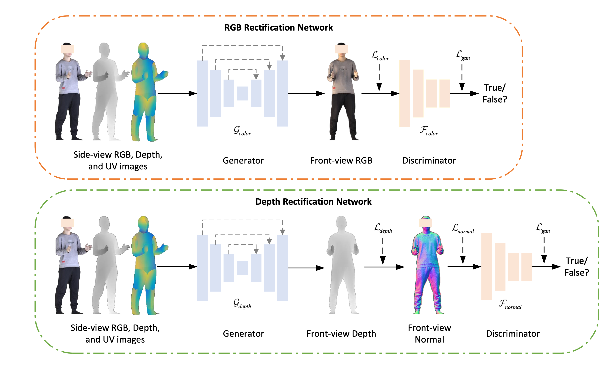

# SFNet: Clothed Human 3D Reconstruction via single Side-to-Front view RGB-D image.

This repository contains a pytorch implementation of "[SFNet: Clothed Human 3D Reconstruction via single Side-to-Front view RGB-D image. (ICVR 2022)]".<br/>
Authors: Xing Li, Yangyu Fan, Di Xu, Wenqing He, Guoyun Lv, Shiya Liu.


---
### Software Environment
1. OS Environment
```
cudaToolKit == 11.3
cuda == 11.0
```

2. Python Environment (We provide the whole env in )
```
python = 3.8
pythorch = 1.15
numpy = 1.14
opencv = 3.4
PIL = 5.1
```
---
### Hardware Environment
The framework only can be used in GPUs.

### Train the model by running:
0. Install the JackFramework lib from Github (https://github.com/Archaic-Atom/JackFramework)
```
$ cd JackFramework/
$ ./install.sh
```

1. Get the Training list or Testing list （You need rewrite the code by your path, and my related demo code can be found in Source/Tools/genrate_thuman_****_path.py）
```
$ python ./Scripts/generate_thuman_training_path.py
```
or
```
$ python ./Scripts/generate_thuman_testing_path.py
```

2. Train the program, like:
```
$ ./Scripts/start_train_thuman_model.sh
```

3. Test the program, like:
```
$ ./Scripts/start_test_thuman_model.sh
```

---
### File Structure
```
BodyReconstruction
├── Datasets # Get it by ./generate_path.sh, you need build folder
│   ├── dataset_example_training_list.csv
|   ├── dataset_example_testing_list.csv
|   ├── dataset_example_testing_val_list.csv
│   └── ...
├── Scripts # Get it by ./generate_path.sh, you need build folder
│   ├── clean.sh         # clean the project
│   ├── generate_path.sh # generate the tranining or testing list like thuman_training_list.csv
│   ├── start_train_dataset_model.sh # start training command
│   ├── start_test_dataset_model.sh # start training command
│   └── ...
├── Source # source code
│   ├── UserModelImplementation
│   │   ├── Models            # any models in this folder
│   │   ├── Dataloaders       # any dataloaders in this folder
│   │   ├── user_define.py    # any global variable in this fi
│   │   └── user_interface.py # to use model and Dataloader
│   ├── Tools # put some tools in this folder
│   ├── main.py
│   └── ...
├── LICENSE
└── README.md
```


 